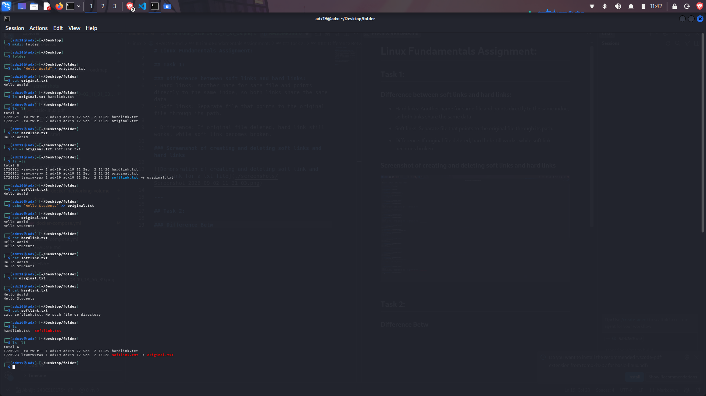
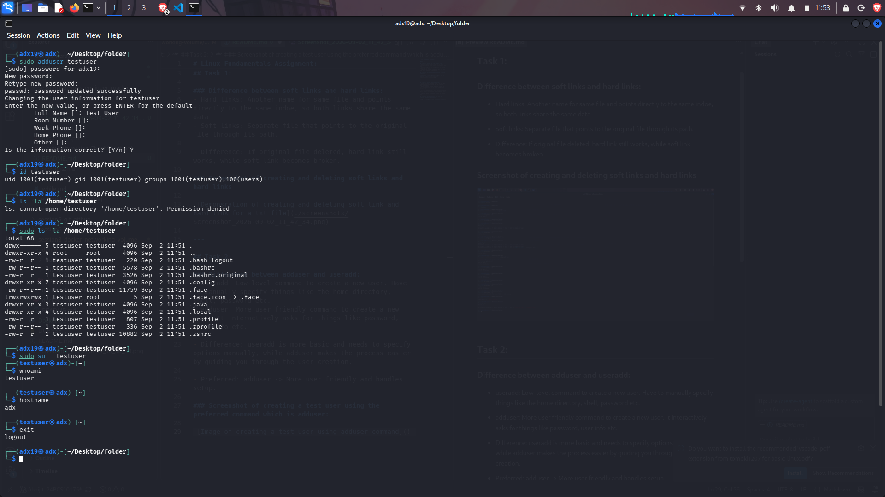
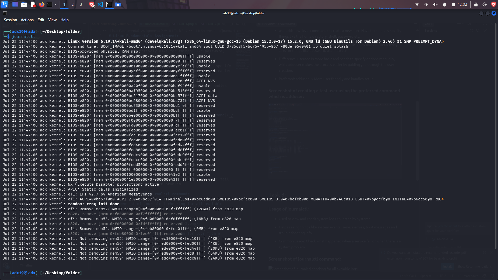
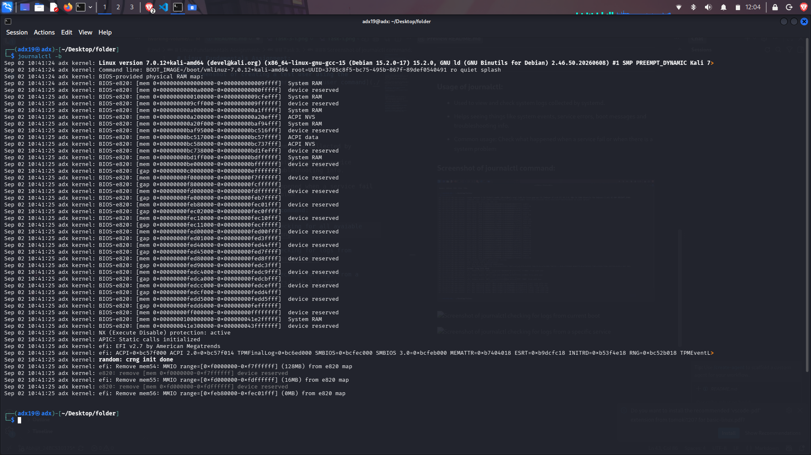
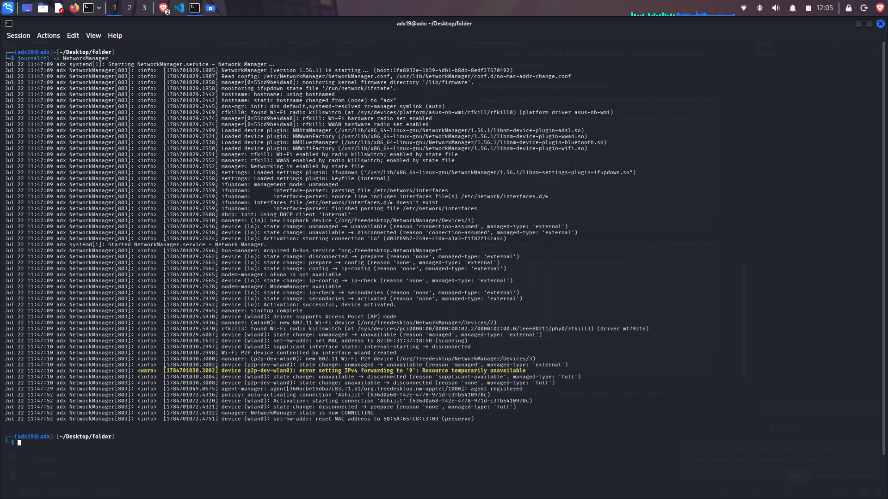

# Linux Fundamentals Assignment:

## Task 1:

### Difference between soft links and hard links:
- Hard links: Another name for same file and points directly to the same indoe, so both links share the same data
- Soft links: Separate file that points to the original file through its path.

- Difference: If original file deleted, hard link still works, while soft link becomes broken.

### Screenshot of creating and deleting soft links and hard links

---

## Task 2:

### Difference between adduser and useradd:
- useradd: Low-level command to create a new user. Have to manually specify things like the home directory, shell, password etc.
- adduser: More user friendly command to create a new user. It interactively asks for things like password, user info etc.

- Difference: useradd is more basic and needs to specify options manually, while adduser makes the process easier by guiding you through the user creation.

- Preferred: adduser -> More user friendly and handles setup.

### Screenshot of creating a test user using the preferred command which is adduser:

---

## Task 3:

### Usage of journalctl:
- Used to view and check system logs collected by systemd.
- Helps seeing things like system events, service errors, boot messages and troubleshooting info.

- Common usage: Check what happened when a service fail or when there is a system problem

### Screenshot of journalctl command:

---

## Task 4:

