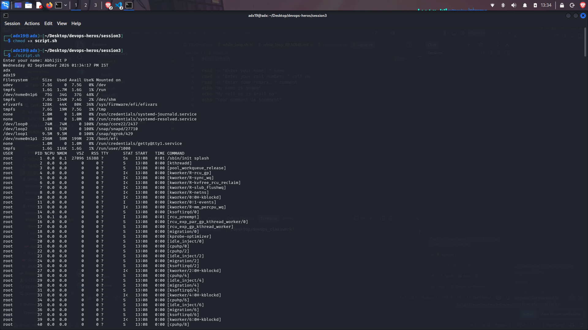
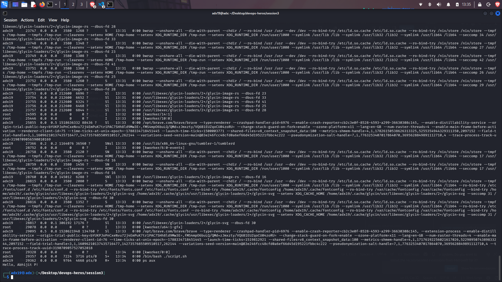

# Shell Scriptiing Homework Tasks:

## Task:
 - Created a shell script file named script.sh.
 - Contains commands that satify the condition of the task

## Script: 

[Code for the shell script](script.sh)

## Screenshot of shell script in running:
- The output for all running process was long. Therefore the first few lines and the last few lines are only captured.

## Output:

[The output of the whole script i.e, output.log](output.log)