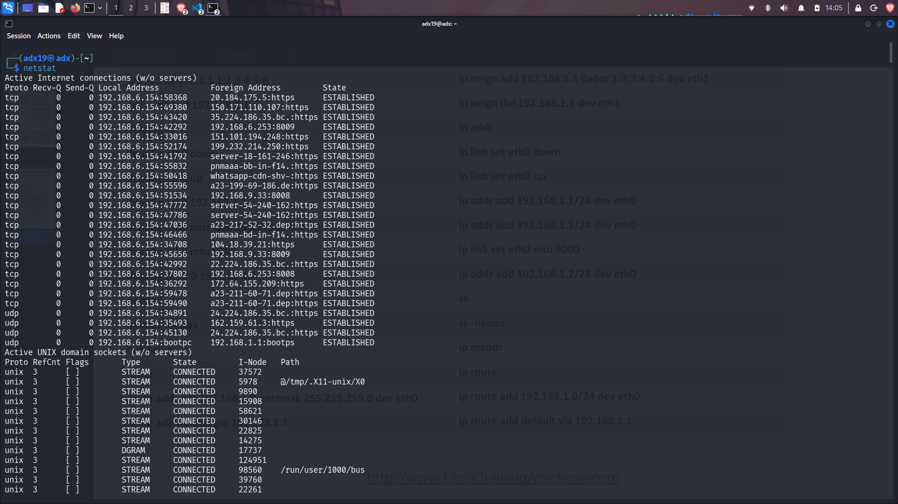

# Networking Homework Task

## Task 1:

### Commands List:

[This is the commands that had been referred inorder to complete this task](../session2-linux/Linux%20Networking%20Cheat%20Sheet.pdf)

## Task 2:

- The screenshots of all the commands from the given cheat sheet running is given below

## Screenshots:

- ip addr :
    

- ip link:
    

- ip -s link:
    

- ip route:
    

- ip maddr:
    

- ip neigh:
    

- ip add:
    

- ip del:
    

- netstat:
    

- ifconfig -a:
    

