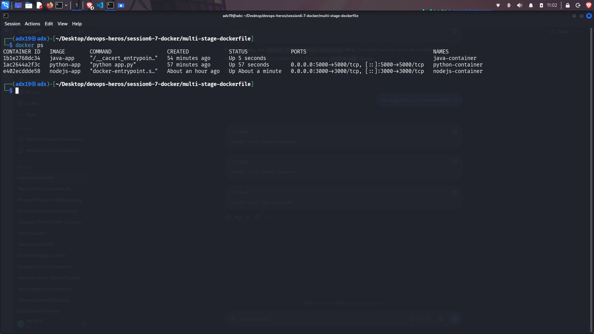

# Docker Multi-Stage Build Homework

## Name: Abhijit P
## Roll Number: 24BCS10175

## Task 1 and Task 2: 

- The application is running successfully on port 8080
- Images are given below

## Screenshots:

- Running application on port 8080:
    

- docker ps
    

---

## Task 3:

- [The nodejs, python and java app was already launched the screenshot of website is given here along with the code](../Docker%20Fundamental%20Task/)

- The screenshot of docker ps of same is given below

## Screenshot of docker ps for nodejs, python and java app:

- 